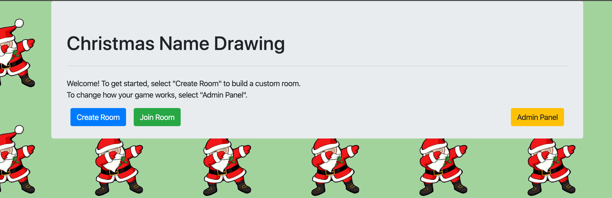

ChristmasNameDrawing
===================
This name drawing web application was built to solve an inherent problem of drawing names at Christmas. How is this a complicated problem? If you are like my family, we have spouses, and honestly, drawing your spouses name for Christmas is lame. (We're probably already buying them a gift anyway, so this just becomes a burden to purchase a separate gift.) 

This little application solves this problem (and a couple other ones as well).

## Feature List
####  Generate room codes so that an unlimited number of drawing games can be played at the same time. 

 - Great if you have multiple family Christmas events to attend and they each have their separate name drawings.
 - An easy to share, generated room code is also provided so that you can send the URL to the participants easily.

#### Drawing restrictions. 
 - Admins can setup the rules on who can draw who. Easily allow for spouses to be removed from the drawing possibilities. 

#### Easy logins
 - Most websites that provide a similar feature require you provide an email to create an account - in some cases, each person needs an email provided to play. This has no such requirement. The login is just the room code and their name.

#### Customize Drawing Format
 - Want the game to play so there is no dead end? And the first person who gives their gift is the last to receive? You can change the behavior of the game to allow or not allow this!

#### Draw your name on your own schedule
 - Have family members who are busy and can't join to draw a name at the same time as everyone else? This system allows players to draw their name on their own schedule without needing to be present or available with everyone else.

#### Make a mistake?
 - All names can be easily cleared and corrected using the simple to use interface. See pictures below.

#### Cheaters?!
 - Since the login is so easy to get in, the game prevents users from viewing a name twice and locking out the results. Should a player forget who they drew, they can contact the admin and from our admin panel, easily be unlocked to allow a re-view. 

## Other ideas?
If you have ideas to make this more fun and interactive, please let me know! I'm always open to suggestions.

#### Ideas under review:
- Wishlists
- Breadcrumb / progress flow

## Final Thoughts
This game was made to solve our family problem when it came to drawing names at Christmas. If you use it for your own Christmas and it worked great, please let me know you enjoyed it. I love hearing from people who use my stuff to solve their problems. If you have any questions, please reach out. 

## Screenshots
Welcome / Landing Page

Main Admin Landing Page

Adding Names to Draw list

Player Restrictions

Unlocking Users to allow them to re-view their drawn name.

Landing Page for a Player

Drawn Name

Oops! You are locked out.
